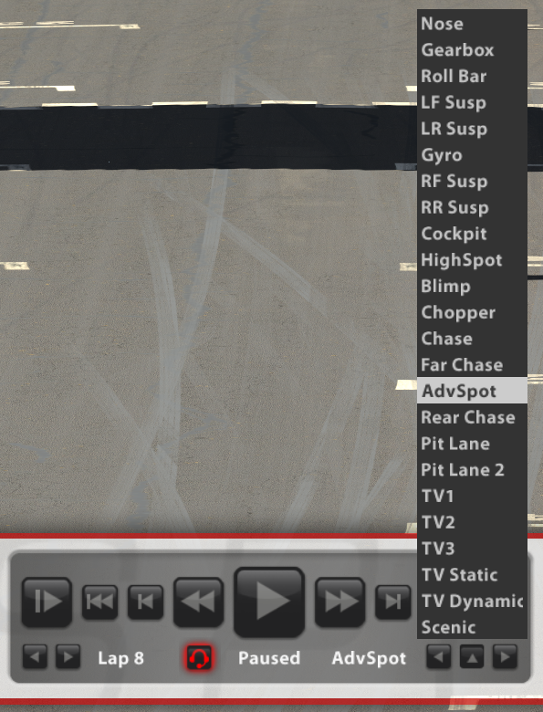
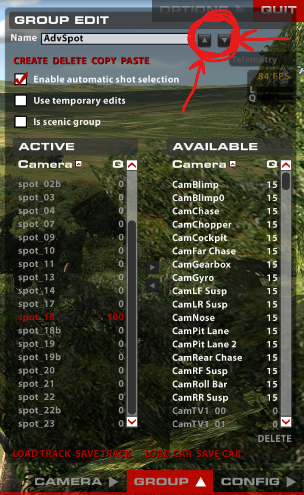
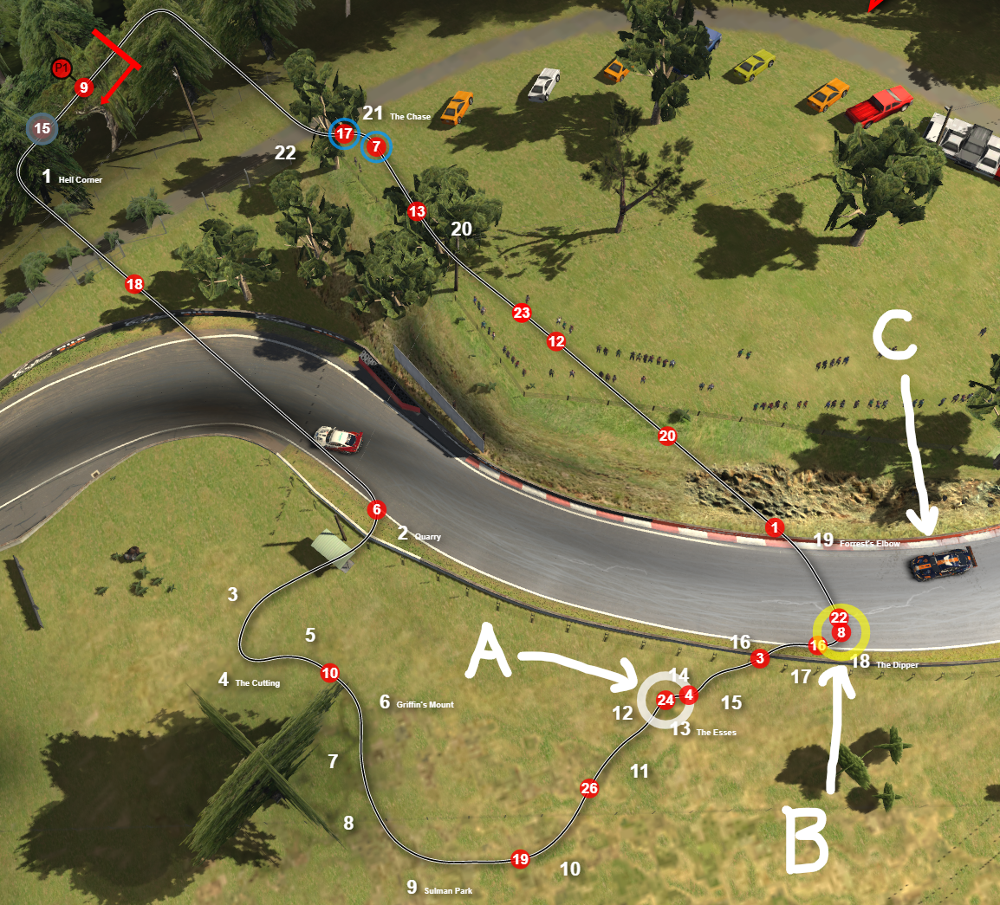

# A Camera Down the Mountain

tl;dr: I put together a camera group [1] for spotting iRacing's *Bathurst 12HR*. You can download it [here](bathurst_advspot_v2.cam). Directions for use are below. The name of the camera group is **AdvSpot** (short for "advance spotter").

[1] A *camera group* is any arbitrary set of camera shots in iRacing. E.g. *TV1* is a camera group: when you watch TV1, the camera shot will change to different individual cameras in the TV1 group.

I applied the following philosophy to create the AdvSpot camera group:

1. You should **clearly** see 5 seconds ahead of the *spotted car* at all times.
2. You should see the *spotted car* at all times.
3. Static shots of the track are preferred.
4. Your view should be such that your left is the driver's left.

I was not able to always apply these rules, but I did apply them in the above priority.

Another assumption I made is that the driver has some other spotter (e.g. CrewChief) to notify them about immediate threats ("car left").

#### 1. You should **clearly** see 5 seconds ahead of the *spotted car* at all times.

I hope this one is obvious. If not, please see exhibit A: The BMW is coming down the mountain: 

Seeing *5 seconds ahead* means that we have to leave our current shot *at least* 5 seconds before the spotted car would leave the shot. A combination of many cameras, and some long shots is used to accomplish this. AdvSpot is made up of 24 different cameras (shots): for a 2:06 lap, you spend 5.25 seconds at each camera.

#### 2. You should see the *spotted car* at all times.

It's boring to spectate a race and not watch the car you're cheering for. Always having your car in frame also means that you can perform traditional spotting in a pinch ("car left"), or give guidance on track rejoins, etc.

#### 3. Static shots of the track are preferred.

Static cameras don't move, so you're less likely to become confused about which direction you're facing. And you can set the camera up so that your view isn't obscured. See also exhibit B: The chopper view of the BMW coming down the mountain:\

Unfortunately, trees, walls, bridges, and long straightaways make achieving this goal difficult; I cheated and used a few chase cams on straightaways.

#### 4. Your view should be such that your left is the driver's left.

When I'm looking *backwards* and need to tell the driver about something on *their left*, it takes my brain a split-second too long to flip my right to their left. This means that cameras are generally placed *behind* the driver, aiming down the direction of travel. Due to obscured sight-lines at Mount Panorama this isn't always possible, so there are a few backwards shots.

### Directions

Put the downloaded .cam file in your `Documents\iRacing\cameras\tracks\bathurst` directory. When in the sim, bring up the camera controls (Ctrl + F12), and on the `group` tab, `load track`, and select the `bathurst_advspot_v2.cam` file. `AdvSpot` should now show up in your list of cameras in the replay controls:

**Note these buttons on the group editor control:**\

The circled buttons can be used to move the camera group up or down in the list of cameras. **A camera's position in the camera list is its number.** Also note that you cannot change the position (or number) of the first 9 cameras (The *Nose* camera is always *camera 1*). A camera's number is used in the shortcut controls [^1]:

`*[car number]*[camera number] <enter>`: Focus specified camera on specified car.\
`*[car number] <enter>`: Focus current camera on specified car.\
`**[camera number] <enter>`: Switch to specified camera, keeping focus on current car.

I bump `AdvSpot` up to position 10 (`**10 <enter>`), and move the chase cams up to positions 11-13, just so I know how to quickly access them.

I using [Joel Real Timing](http://joel-real-timing.com/) (JRT) for the track map overlay, so I can quickly navigate to problem areas:

In the above, **C** is the current focused car, as represented by **A** on the JRT overlay. **B** is the stopped car from exhibit A above.  To switch from this view, to the view shown in exhibit A at the top (coming down the mountain) I simply pressed `*8 <enter>`. (JRT highlights slow cars as a configurable option.)

### References

[^1]: iRacing *[iRacing Camera Tool](https://support.iracing.com/support/solutions/articles/31000157467-iracing-camera-tool)*
