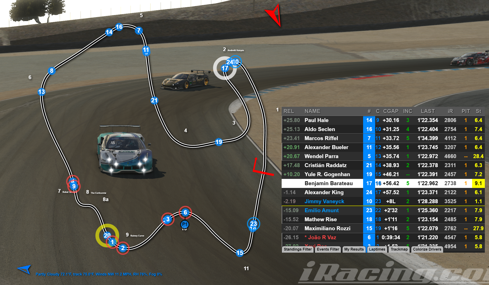

## Spotting with Joel Race Timing

*Figure 1: a rear chase view with some Joel Race Timing overlays*

Let's start with the motivating example above.

First off, what are we even looking at?

https://www.joel-real-timing.com/

